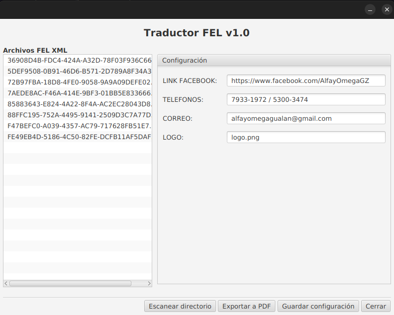
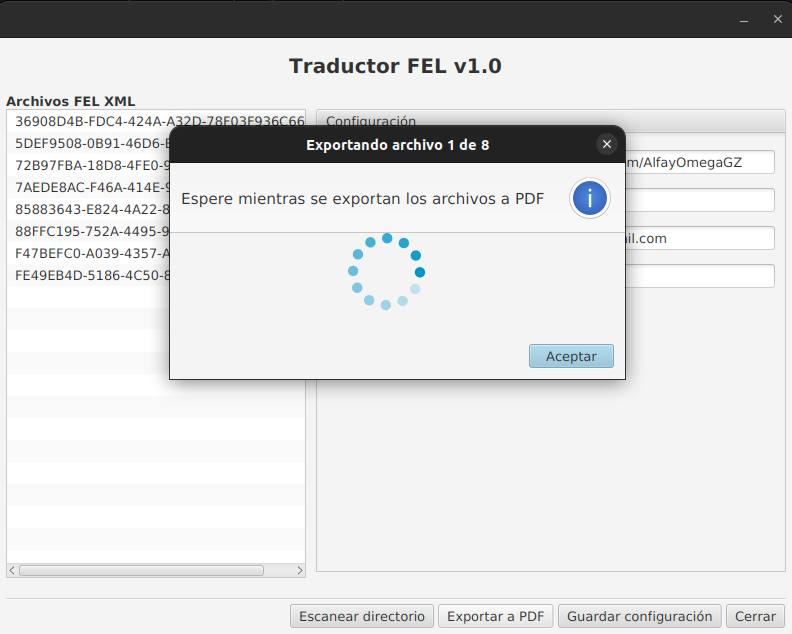

# TraductorFEL

## Descripción

Herramienta para parsear XML de FEL a una plantilla de factura personalizada en formato PDF

## Detalles técnicos

Los detalles técnicos para poder correr el programa son los siguientes:

- Programado en Java versión 11 (no modular)
- JavaFX versión 19
- Jasperreports versión 20
- JAXB para convertir archivos XML en POJOS

